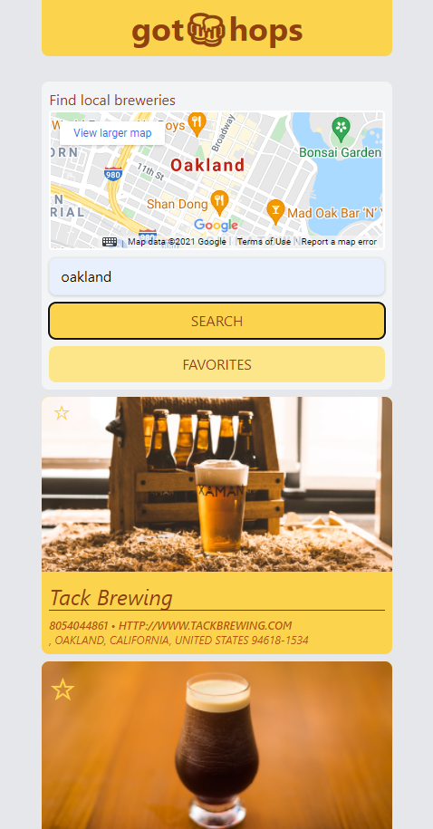

# Got-Hops
A craft brewery search application

## Table of contects

- [Description](#description)
- [Preview](#preview)
- [User Story](#user-story)
- [Website](#website)
- [Contributions](#contributions) 
- [Images](#images)
- [Built With](#built-with)

## Description
Given a "Beer Dashboard" with form inputs, when I search for a city. I am presented with a list of nearby breweries. When I click the search button the closest brewery is displayed followed by a list of other breweries. When I click on a brewery, I am presented with a details of the brewery. When I click on a starred brewery recommended by others I can add it to my favorites and the favorites are stored to local storage. 

## Preview
### -Header
### -Search
### -Results
### -Map
### -Favorites

## User Story
As an avid connoisseur of crafted beer from around the world.
I want a web application that finds nearby breweries with pricing and a list of the types of craft beers available.
So that I can find nearby ones, but also ones that are off the grid and not as well known.

## Website
[View Live Site](#got-hops)

## Contributions

Click to see Contributors

- Scott Rohrig
- Alex Marten
- Mianta McKnight

## Images

## Built with

